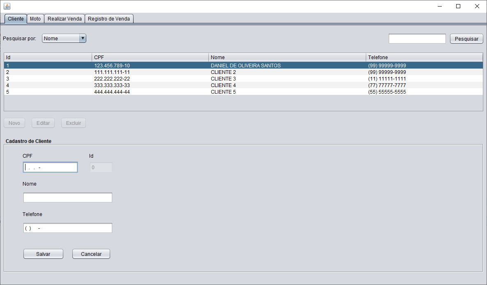
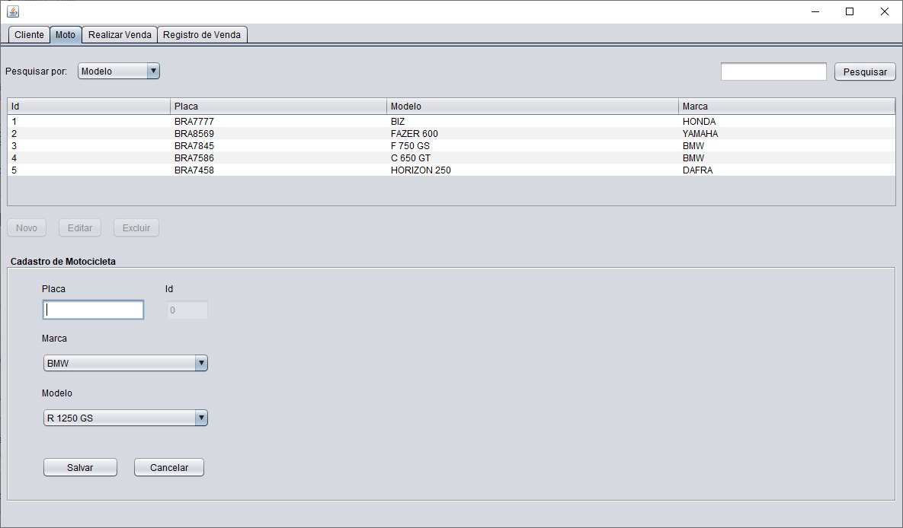
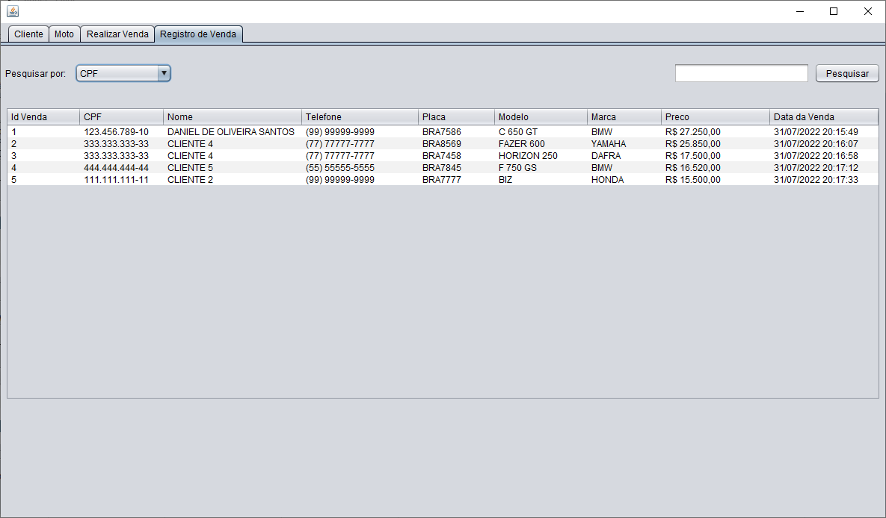

# 🏍️ Controle de Concessionária
Projeto de controle de vendas para uma concessionária de motos. O sistema permite total acesso as informações de todas as motos cadastradas no banco de dados, assim como de seus clientes. Podemos realizar o cadastro de clientes e motocicletas, além de modificar e excluir os mesmos.

Além disso, o projeto permite realizar a venda de uma motocicleta a um cliente, se ambos estiverem cadastrados no banco de dados. Após efetuar a venda, o registro da mesma ficará salvo e a moto vendida será excluída do database.

Tecnologias utilizadas:
 - Java
 - SQL

##  🔸 Screenshots

▫️ Desktop  
 
 
 
 
